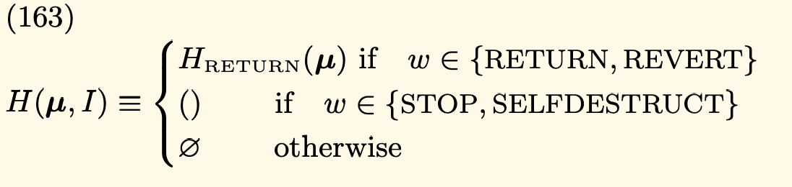

# Goal
The goal for day one is to be able to execute a single EVM instruction.
We will be using the [yellow paper](https://ethereum.github.io/yellowpaper/paper.pdf) in order to implement this first execution.
We will be using [EVM opcodes](https://www.evm.codes/?fork=cancun)
We will be using [EVM illustrated](https://takenobu-hs.github.io/downloads/ethereum_evm_illustrated.pdf)

# Concept used
- Code is not stored in general available memory/storage (the standard von Neumann architecture) but separately in a virtual ROM interactable only through a specialised instruction.
- On exception the VM stop immideatly and reports the issue to the execution agent (either the transaction processor or, recursively, the spawning execution environment) which will deal with it separately.

# Instruction to implement
| Value | Mnemonic | δ: stack input | α: stack output | Description | Min Gas |
| ----- | -------- | - | - | ----------- | - |
| 0x00  | STOP     | 0 | 0 | Halts execution.| 0 |

When a call is executed on an address with no code and the EVM tries to read the code data, the default value is returned, 0, which corresponds to this instruction and halts the execution.

The data-returning halt operations, RETURN and REVERT, have a special function HRETURN. 
Note also the difference between the empty sequence and the empty set as discussed here.

